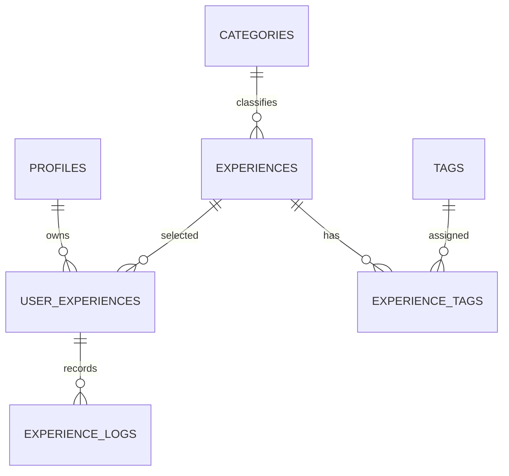

# はじめてちょう データベース設計

## 状態の判定

状態そのものは保存せず、親子レコードの存在から判定する。

| 状態 | 判定 |
| --- | --- |
| 探す | `user_experiences`が存在しない |
| やってみたい | `user_experiences`が存在し、`experience_logs`が0件 |
| やってみた | `user_experiences`が存在し、`experience_logs`が1件以上 |

これにより、ステータスと履歴件数の不整合を防ぐ。

## ER図

## 主な運用ルール

- 「やってみたい」の取消は、履歴がない`user_experiences`を物理削除する。
- 履歴の削除は、対象の`experience_logs`だけを物理削除する。
- 最後の履歴を削除した場合、親は残るため自動的に「やってみたい」へ戻る。
- 体験マスタは公開後に物理削除せず、`archived`へ変更する。
- 体験日は年を必須、月日を任意とする。概算の場合は`is_estimated`を使用する。
- 写真は履歴1件につき、お気に入りの1枚だけ保存する。
- ユーザー向けエクスポートはCSVと画像をZIPにまとめる。
- システムバックアップは全体障害の復旧用とし、個別ユーザーの復元には使用しない。
- 本人以外へのデータ開示や個別復元は標準サポートの対象外とする。

## 削除と外部キー

- ユーザー退会時は、`profiles`から個人の関連データを連鎖削除する。
- `user_experiences`を削除すると、その履歴も連鎖削除される。ただしRLSにより履歴がある親の通常削除は禁止する。
- `experiences`と`categories`は参照中の物理削除を禁止する。
- タグをマスタから外す場合は、先に`experience_tags`を削除する。

## 公開範囲

- 公開中の体験、カテゴリ、タグは未ログインでも閲覧できる。
- `user_experiences`と`experience_logs`は本人だけが読み書きできる。
- マスタの登録・更新・アーカイブは管理者用経路から行う。
